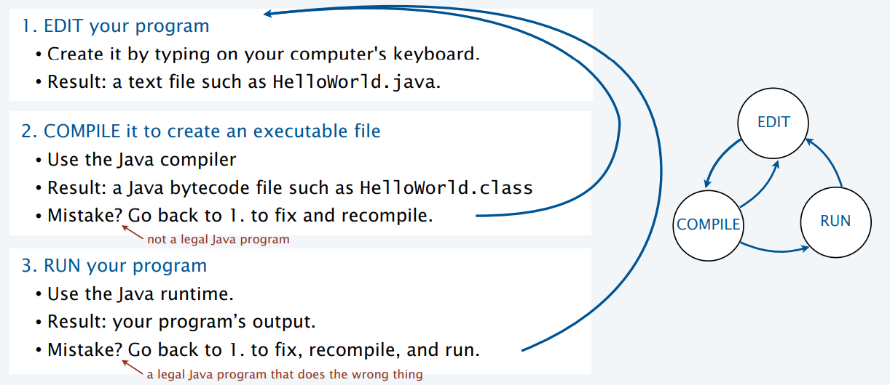
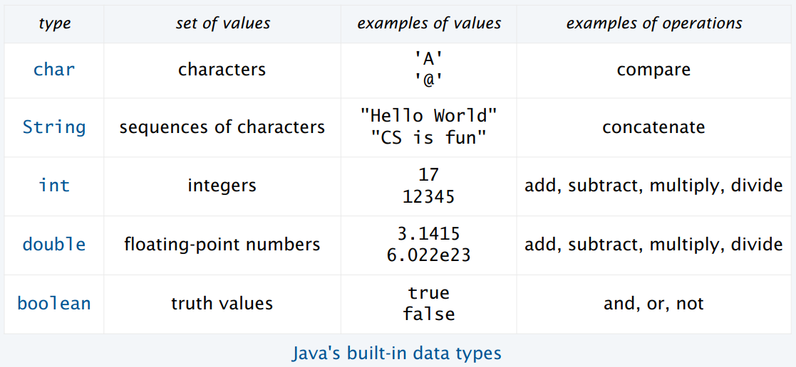
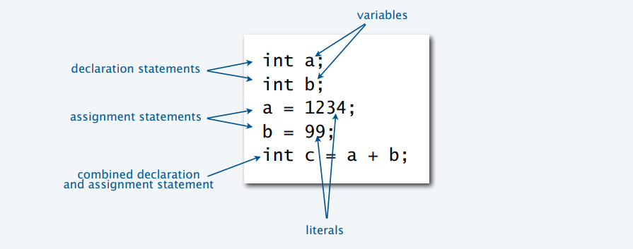

# Programing with a purpose

## Basic Progamming Concepts

Why you need to know how to program? In order to be able to tell a computer what you want it to do.

How do you do it? programming through a high level language, which is a middle ground between natural language and computer/machine language.

Examples of programming languages: C, C++, C#, Java, JavaScript. Java will be used in this course.

First Java Program

Basic programming workflow: edit, compile an run. You edit your program in a text file with a extension ".java". When you are done, you compile it creating a file with a ".class" extension. You can then run your compiled file using java to execute the program.

### Built-in Data Types

A data type is a set of values and a set of operations on those values.

A **variable** is a name that refers to a value.
A **literal** is a programming-language representation of a value.
A **declaration** statement associates a variable with a type.
An **assignment statement** associates a value with a variable.

